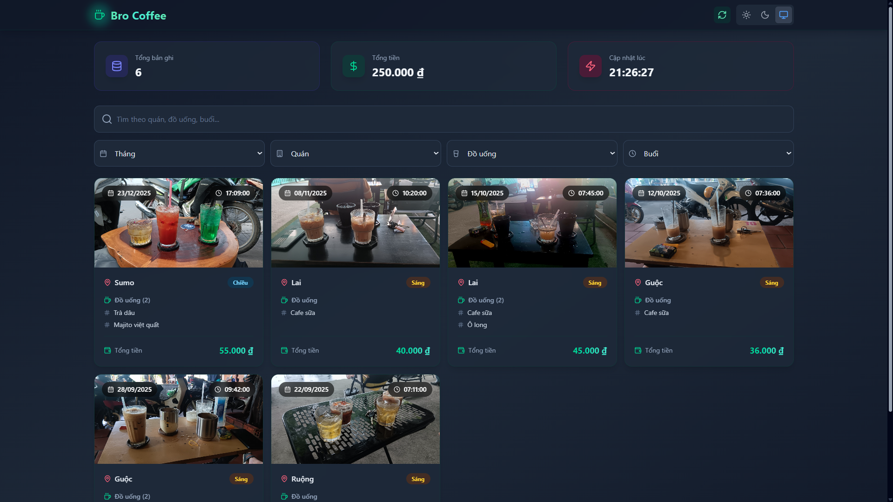

# ☕ Bro Coffee

Bro Coffee là một ứng dụng web giúp bạn **theo dõi lịch sử uống cà phê, chi tiêu, địa điểm và thói quen cá nhân**. Dữ liệu được **đồng bộ trực tiếp từ Google Sheets**, hiển thị dưới dạng card trực quan, có filter, thống kê và hỗ trợ dark mode.

## 📸 Hình Ảnh



---

## ✨ Tính năng chính

- 📊 **Thống kê nhanh**: tổng số bản ghi, tổng tiền đã chi, thời điểm cập nhật gần nhất
- 🔍 **Bộ lọc thông minh**: tìm kiếm theo quán, đồ uống, buổi, tháng
- 🗂 **Phân trang**: hiển thị dữ liệu gọn gàng, dễ theo dõi
- ☕ **Card UI hiện đại**: icon + màu sắc trực quan, hover animation mượt
- 🌗 **Dark / Light mode**: tự động theo theme
- 💸 **Định dạng tiền Việt (VND)** chuẩn
- 🔗 **Kết nối Google Sheets realtime** (CSV public)

---

## 🧱 Tech Stack

- **React 18**
- **Vite**
- **Tailwind CSS**
- **Lucide Icons**
- **Google Sheets (CSV publish)**

---

## 📁 Cấu trúc thư mục

```
src/
 ├─ components/
 │   ├─ CoffeeCard.jsx
 │   ├─ Filters.jsx
 │   ├─ Pagination.jsx
 │   └─ StatCard.jsx
 │
 ├─ utils/
 │   ├─ format.js
 │   └─ constants.js
 │
 ├─ App.jsx
 └─ main.jsx
```

---

## 📊 Schema Google Sheets

Google Sheets cần có **đúng tên cột** sau:

| Cột      | Mô tả                    |
| -------- | ------------------------ |
| date     | Ngày uống cà phê         |
| time     | Thời gian                |
| session  | Buổi (Sáng / Trưa / Tối) |
| place    | Tên quán                 |
| drink    | Tên đồ uống              |
| price    | Giá tiền                 |
| imageUrl | URL hình ảnh (tuỳ chọn)  |

📌 Sheet cần được **Publish to the web** và cho phép public.

---

## 🚀 Cài đặt & Chạy project

### 1️⃣ Clone project

```bash
git clone https://github.com/your-username/coffee-wrapped.git
cd coffee-wrapped
```

### 2️⃣ Cài dependencies

```bash
npm install
```

### 3️⃣ Chạy dev

```bash
npm run dev
```

Mở trình duyệt tại: `http://localhost:5173`

---

## ⚙️ Cấu hình Google Sheets

Trong `App.jsx`, thay giá trị:

```js
const SHEET_ID = "YOUR_SHEET_ID";
const SHEET_NAME = "Sheet1";
```

Link CSV được dùng:

```
https://docs.google.com/spreadsheets/d/{SHEET_ID}/gviz/tq?tqx=out:csv&sheet={SHEET_NAME}
```

---

## 🎨 UI & Theme

- Tailwind CSS + dark mode
- Border, text, background đều có `dark:` tương ứng
- Màu sắc có chủ đích:

  - Blue: dữ liệu
  - Emerald: tiền
  - Violet: thời gian / cập nhật

---

## 🛠 Utils quan trọng

### Định dạng tiền Việt

```js
formatVND(50000); // "50.000 ₫"
```

### Parse giá từ Google Sheets

```js
parseVND("50,000"); // 50000
```

---

## 🧠 Định hướng phát triển

- 📈 Thống kê theo tháng / quán
- 📊 Chart chi tiêu (Recharts)
- 🏷 Tag session / drink
- ❤️ Favorite đồ uống
- 📱 PWA – cài như app mobile

---

## 📄 License

MIT License

---

> Made with ☕ & ❤️ — **Bro Coffee**
